cpc-gan   base on Representation Learning with Contrastive Predictive Coding and https://github.com/davidtellez/contrastive-predictive-coding

explanation： https://mp.weixin.qq.com/s?__biz=MzA5MDMwMTIyNQ==&mid=2649293567&idx=1&sn=ebaf1632f04bab16b0cc3fb8fff9f320&chksm=881014b9bf679dafdbc94b350ad67cbad94b7363c5053f37d3881aed395828c624cfeafd6202&token=212101831&lang=zh_CN#rd

ref： Formal Limitations on the Measurement of Mutual Information https://arxiv.org/abs/1811.04251

result_fig/cpcgan41_10_0.png

    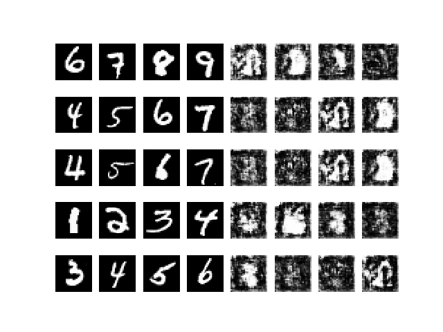

cpcgan41_10_1

    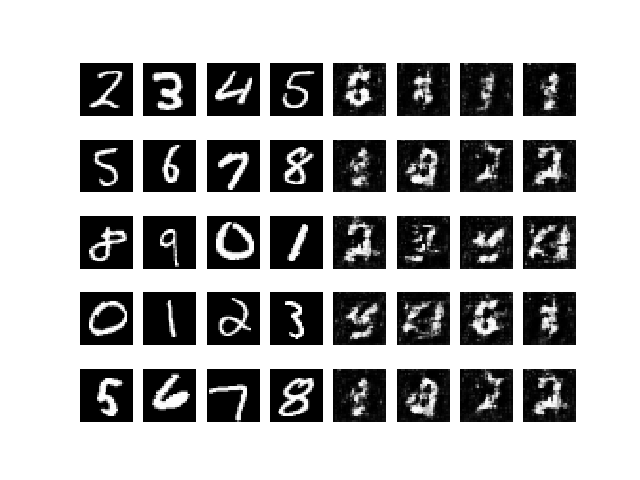

cpcgan41_10_105

    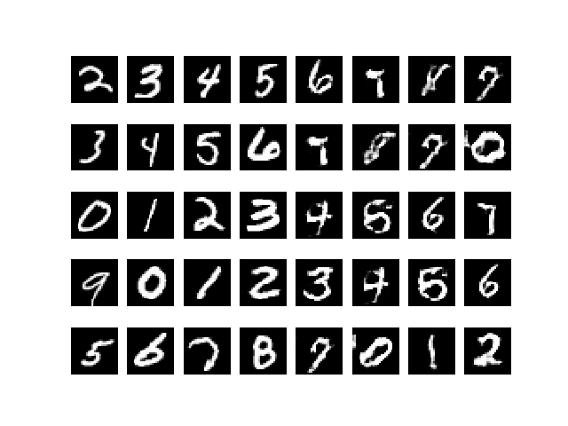

cpcgan41_10_117

    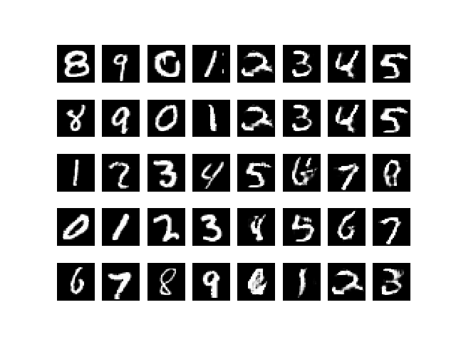

cpcgan41_10_2

    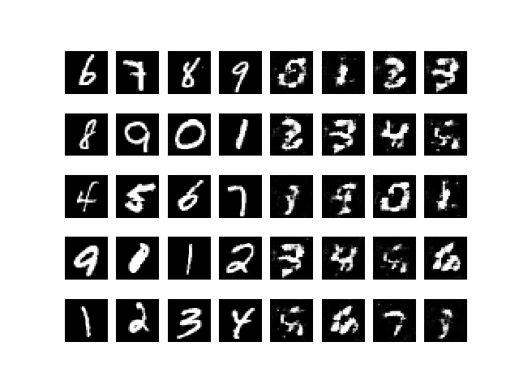

cpcgan41_10_25

    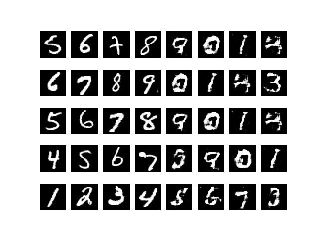

cpcgan41_10_54

    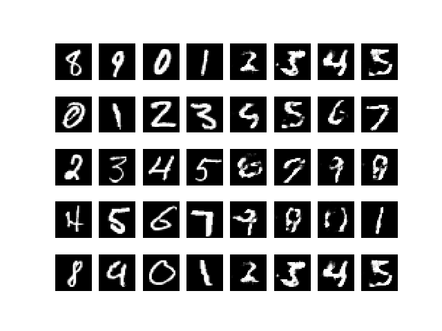

cpcgan41_10_91

    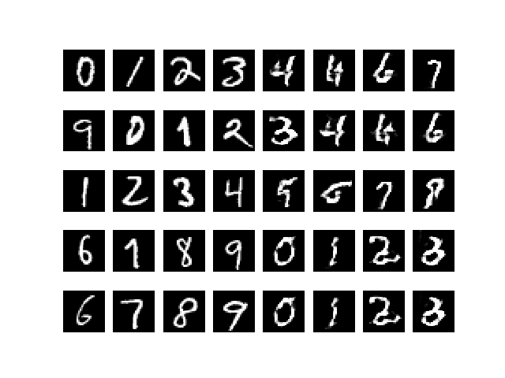

cpcgan41_10_957

    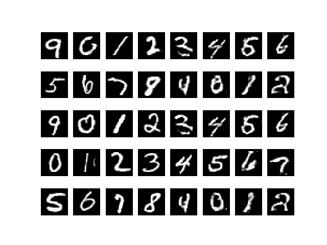

cpcgan41_10_965

    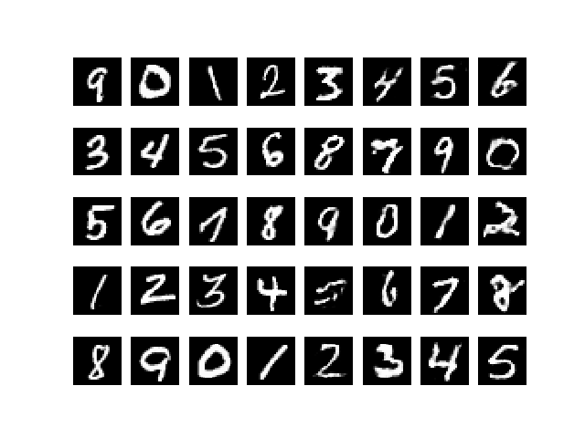

cpcgan41_10_987

    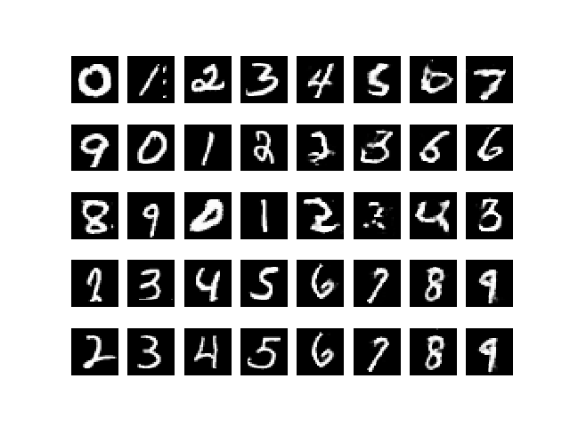

cpcgan41_10_992

    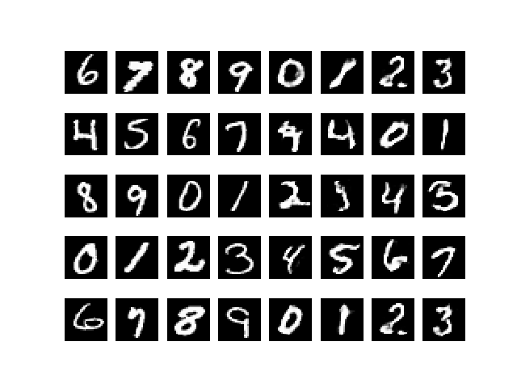

